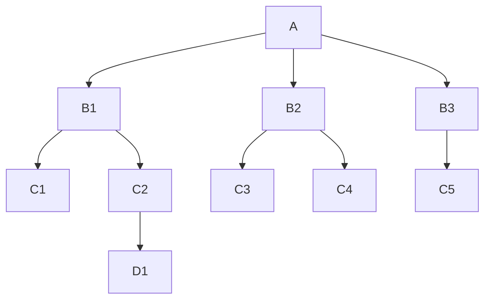

# 一个小型的区块链实现

## 运行


## 介绍

本文主要是在学习链的过程的一些总结，个人学习的思路，首先了解区块链大的技术架构，其次去想一些问题，带着问题去了解区块链如何解决这些问题的。目前的技术文章大部分都是对区块链原理从头到尾的科普式教程，对于我而言不能很好吸收知识，我是带着问题反复看了 [btcd](https://github.com/btcsuite/btcd) 的源代码实现后，有了比较深刻的理解。 基于自己的理解，实现了一个小型的区块链。

从大的层面看，区块链主要包含以下几个部分
- [主体链](#主体链)
- [挖矿](#挖矿)
- [节点通信](#节点通信)
- [交易](#交易)

## 主体链

### 简介

区块链是由一个个的节点以链的形式连接起来，最终形成的一个树型结构，结构如下图所示。 区块链不是并不是某一条链，而且一个有着共同祖先的一系列链的结构。  



每个节点都是一个区块，其中 A 区块是根节点，作为创始区块。区块链从根节点往下无限延伸，选择其中最累积工作量最长的链作为主链。 

### 区块链结构

这里我们只选择一些核心的数据信息

- Hash: 区块节点的唯一哈希值
- PreHash: 前一个区块的哈希值

```
{
    Hash: string
    PreHash: string
    ...
}

```

区块哈希值由区块内的自身数据和前一个区块的哈希值作为输入，经过哈希映射出来的值，这也意味着区块内任何一个值发现生化, 它的哈希值也会不一样。

```
var hash = sha256(PreHash+自身区块数据)
```

由于 Hash 和 PreHash 的结构，就可以成功一个如上图的树形结构。

由于每一个区块都包含前一个区块的哈希值，比如说其中一个节点的值被串改了，那么它实际的 hash 肯定会变，而子区块已经包含了原来的 hash 值，经过对比就可以发现这个区块是无效的。 由于每个区块都是可验证的，因而保证了整个区块链都是不可串改的。

实际的区块结构可以看这里 [btcd blockNode](https://github.com/btcsuite/btcd/blob/master/blockchain/blockindex.go#L66)


### 创世区块

创始区块是根区块，这个是区块链初始化时建立的，由区块链的创建人员手动来生成。它的 PreHash 值是空值


## 挖矿

挖矿的过程就是区块链生成新的区块节点的过程，主要会涉及到区块的两个属性值，Nonce 和 Difficulty. Nonce 是工作量证明的值，Difficulty 是困难度。

```
{
    Hash: string
    PreHash: string
    Nonce: int64
    Difficulty: int64
}

```

### 工作量证明

挖矿就是经过一段计算后，找到一个值，使得它满足某个特征。 实际的做法是设置一个 nonce 值为0，然后循环+1，把这个 nonce 值作为 hash 生成的变量之一，如果 hash 值的前 N 位都是 0，即为挖到了矿。 这个 nonce 值就是这次工作量证明， N 就是困难度。 找到符合条件的 nonce 的过程，就是工作量证明的过程。

```
var nonce = 0
var hash = ""
for {
    hash = sha256(PreHash + nonce)
    if (hash 前 N 位都是0){
        break
    }
    nonce=nonce+1
}

```

[btcd 工作量证明实现](https://github.com/btcsuite/btcd/blob/master/mining/cpuminer/cpuminer.go#L207)

### 困难度

在一个常见的 pow 链中，Difficulty 值是动态变化的。
实际的做法是，设置一个默认的困难度，在某一条链上每生成 M 个新区块后，困难值自动增加1。

[btcd 困难度计算](https://github.com/btcsuite/btcd/blob/master/blockchain/difficulty.go#L221)


## 节点通信

一个节点启动的时候，需要获取至少一个对等节点的地址，才算加入了区块链的网络。对于一个新的比特币节点，启动的时候会从一个 dns 服务器中去获取节点信息。通常我们说区块链是完全去中心化，但是其实不是 100% 正确的，因为始终需要有一个中心化的服务器来分发节点地址。中心化的 dns 服务器会维护一系列常用的可靠的活跃节点信息。

当一个节点获取到其中一个对等节点后，会向对应节点获取它维护的对等节点列表，并建立点对点连接。最样我们就可以维护一个对等节点的列表，因为区块链节点有很多，也不需要维护全部的节点信息，可以对列表设置一个容量，比如说 1000 个，当无法连接对等节点后，可以把该对等节点剔除，再从其他对等节点获取新的对等节点。 基于这样的方式，区块链节点中的所有节点都通过 p2p 的方式连接起来了，类似病毒传播一样。

### 区块数据同步

当一个新节点启动后，它本地是没有整个区块链的全部区块数据的，它可以从对等节点请求对等节点维护的区块数据，然后储存在新节点本地。 因为每个节点都维护自己的区块数据，他们的全量区块数据并不是完全一致的，但是他们一定是有共同的祖先的。

挖矿的过程会产生一个新的区块，同时也会把该区块发给自己维护的对等节点。每个节点收到一个区块数据后，根据该区块的 PreHahsh 值去从自己节点维护的链中是否存在对应的父区块，如果没有的话会把这个区块设置成孤立区块，并且缓存起来。 同时去向对等节点请求父区块的信息。 一旦这个孤立的区块链能和自己本地链能连接起来后，就可以把这些孤立的区块加入到本地的区块数据中。


节点的数据同步还包括交易数据，这部分参考后面的交易部分

可以参考 [btcd 的节点实现](https://github.com/btcsuite/btcd/blob/master/netsync/manager.go)


## 交易

区块链中还有一个重要的功能，就是交易。 区块链中的交易，其实是在某个区块内的交易

### 非对称加密

了解交易之前，首先需要了解非对称加密。 在 github 中配置公钥来实现 ssh push 代码，其实就是非对称加密的方式。 它包含一个公钥和私钥，公钥可以由私钥计算出来。 用公钥进行过的加密签名后，可以用私钥来解密。用私钥进行的签名，可以用公钥来验证签名的合法性

在区块链中，可以把公钥类似你的银行账户，它是公开的，私钥就是密码，只能你自己保存。 这也是为什么私钥丢失了之后，资产就找不回来了，因为密码只保存你本地。


### 交易数据结构

交易包含输入，还有输出。 输入就是你的存款数据，输出就是你要转出的数据

```
Transaction {
    id: string
    txInputs: []TXInput
    txOutputs: []TXOuput
}

```

#### 交易输出

交易输出的结构如下

```
TXOutput {
    address: string
    amount: number
}
```

address 就是接受人的公钥地址， amount 是转账的数量

#### 交易输入

```
TXInput {
    txOutId: string
    txOutIndex: int
    signature: string
}
```
交易的输入来源如上一个交易的输出，你的存款来源于其他人给你的转账

- txOutId: 每个交易输入都包含一个 txOutId，它指向上一个交易的 Id
- txOutIndex: 标记它在上一个交易中 txOutputs 的索引位置
- signature: 当你进行转账时，你需要输入密码。 对应在区块链中，当你需要转账时，用你自己拥有的私钥对整个交易进行签名。 接收到这个交易的人，可以根根 txOutId 找到对应的 address，也就是用户的公钥，用公钥可以验证这个这个签名的合法性

### 交易ID

交易 id 是这次交易的唯一值，是通过对交易数据结构中的内容哈希计算后得出来的，计算交易 id 的参数不包含输入的签名信息

```
var id = sha256(交易输入内容+交易输出内容)
```

### 签名生成

```
var signature = privateKey.sign(id)
```
交易 id 是由交易的内容计算生成的，然后用私钥进行签名后。区块链其他节点接收到这个交易信息后，会去验证用你的公钥去验证这个签名的合法性，验证通过了就算是一个有效的交易


### UTXO 模型

UTXO 全称 Unspent Transaction Output，每一个交易里面的 TXOutput 都是存在下一个交易的输入，如果该输出没有被使用，那他就是一个未消费的 Output。基于交易的全量数据，我们可以计算出一个 UTXO 数组，它代表了所有人的资产情况

```
UnTXOutput {
    txOutId: string
    txOutIndex: int
    address: string
    amount: float
}
```

### 原始交易(Coinbase交易)

用户最初的资产，是通过挖矿得到的。 当某个节点挖到矿后，也生成了一个新的区块，这个时候同时会创建一笔 Coinbase 交易。 Coinbase 中 TXInput 的 txOutId 值是空。奖励的金额是由区块链开发者设置好的，比特币就采用了减半机制，每产生210,000个新的区块，金额就变成现有的一半。Coinbase 交易是对矿工的一种奖励机制。


### 区块链如何处理交易

矿工进行挖矿，挖矿的时候需要指定一个钱包地址，也就是你的公钥。成功挖到一个新的区块后，创建一笔 Coinbase 交易，这个区块最初的一笔资产就归属于矿工。同时把这个区块广播给对等节点，区块中包含了 Coinbase 交易的信息。

用户有了第一笔资产后，就可以创建交易在转账给其他人。通常这个行为是在钱包上实现的

一个区块链节点接收到一笔新的交易后，根据自己维护的 UTXO 数据，来验证 TXInput 的资产是否合法。通过校验后，把交易信息保存来本地，同时把交易传播自己维护的对等节点。

这里会有这么一种情况， 有3个节点，A,B,C,  A 转账给 B 50个币，B 又把这个50个币中的20个，转给了 C， 此时 C 没有 A 转账给 B 的这个交易信息。那么 C 收到收到 B -> C 的交易信息，C 在自己的 UTXO 里面找不到对应的 TXOutput。 在区块链中是这么解决这个问题的， C 把这种交易放进一个缓存池里面，这个缓存池也叫交易中继池，同时去向对等节点请求这笔交易之前的交易信息，直到这个交易能够被有效处理


